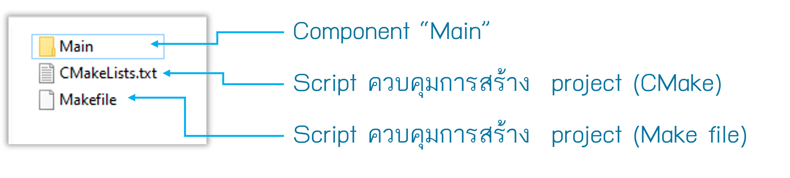
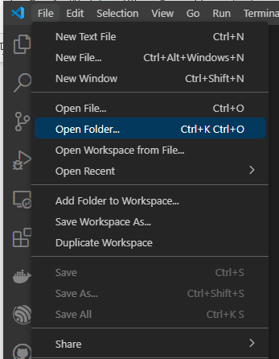
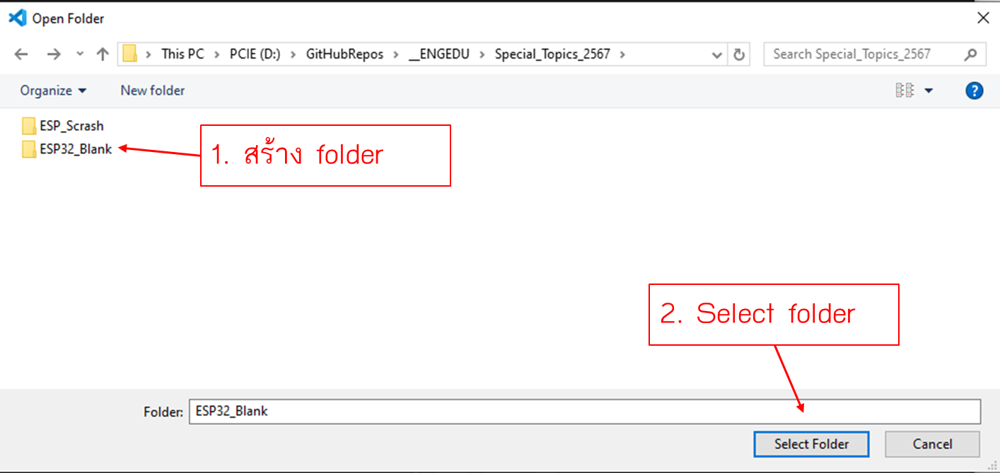
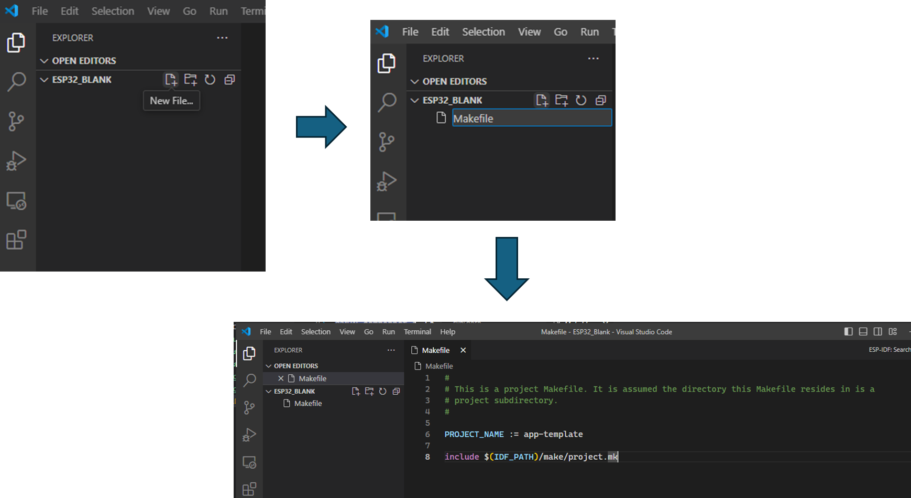
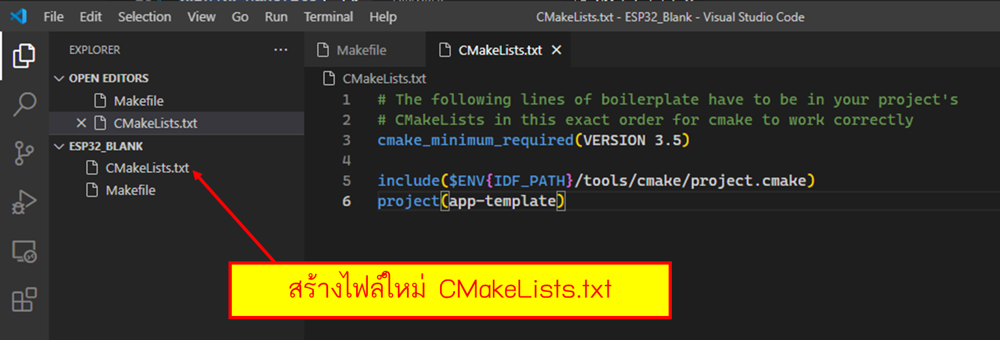
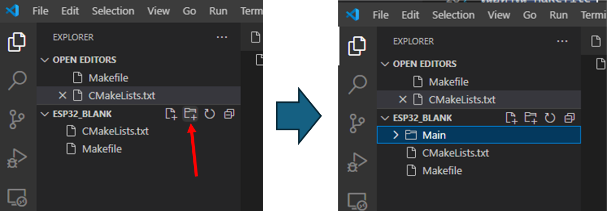
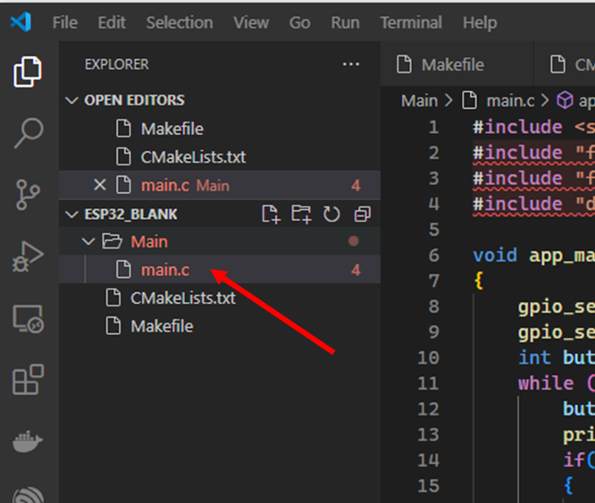
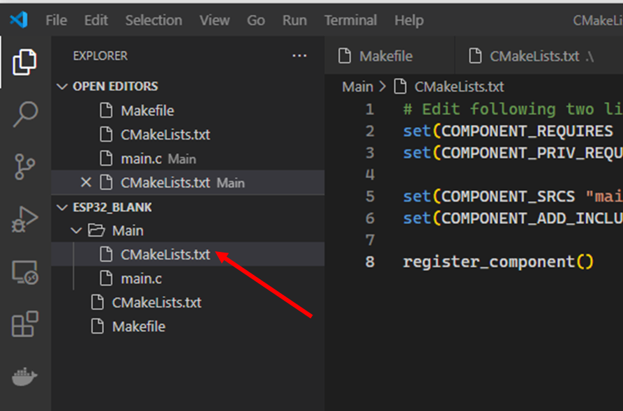
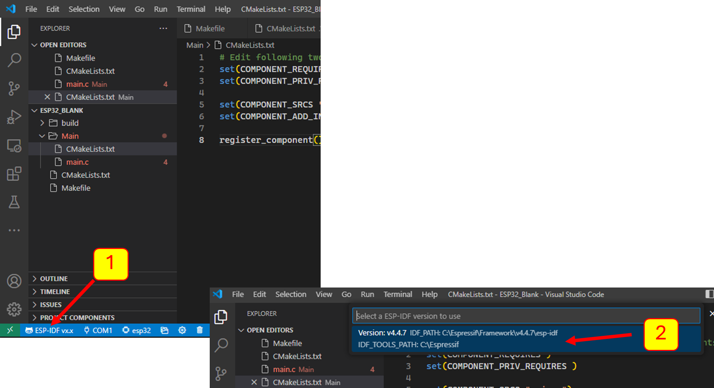
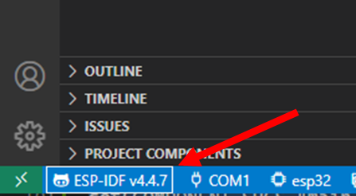

# การสร้าง project ของ ESP32

องค์ประกอบสำหรับโปรเจคของ ESP32 ประกอบด้วย source code และไฟล์จำนวนหนึ่ง ที่ทำหน้าที่เป็นตัวกำกับเครื่องมือช่วยสร้าง project  ให้สามารถทำงานได้
โดยมีโครงสร้างของโฟลเดอร์สำหรับโปรเคดังนี้



ภายใน componnet Main จะมีไฟล์ source code และไฟล์ CMakeLists.txt ไว้สำหรับการสร้าง component เช่นเดียวกัน


## 1.1 สร้าง folder สำหรับ project


1.1.1 เรียกเมนู file --> Open Folder... 



1.1.2 browse ไปที่ folder ที่จะเก็บโปรเจค แล้วสร้าง folder  ใหม่ ในที่นี้ชื่อ ESP32_Blank



1.1.3 สร้างไฟล์ใหม่ ตั้งชื่อ  Makefile และเพิ่มเนื้อหาดังนี้



เนื้อหาใน Makefile

``` makefile
#
# This is a project Makefile. It is assumed the directory this Makefile resides in is a
# project subdirectory.
#

PROJECT_NAME := app-template

include $(IDF_PATH)/make/project.mk
```

1.1.4 สร้างไฟล์ใหม่ ตั้งชื่อ  CMakeLists.txt และเพิ่มเนื้อหาดังนี้



``` CMake
# The following lines of boilerplate have to be in your project's
# CMakeLists in this exact order for cmake to work correctly
cmake_minimum_required(VERSION 3.5)

include($ENV{IDF_PATH}/tools/cmake/project.cmake)
project(app-template)
```


## 1.2. สร้าง folder สำหรับ component Main

1.2.1 สร้าง folder main




1.2.2 เพิ่มไฟล์ main.c



```c
#include <stdio.h>
#include "freertos/FreeRTOS.h"
#include "freertos/task.h"
#include "driver/gpio.h"

void app_main(void)
{
    gpio_set_direction(5, GPIO_MODE_OUTPUT);  // led 1
    gpio_set_direction(GPIO_NUM_17, GPIO_MODE_INPUT);   // button 2
    int button2 = 0;
    while (1) {
        button2 = gpio_get_level(GPIO_NUM_17);
        printf("Button 2 = %d\n", button2);
        if(button2 == 1)
        {
           gpio_set_level(5,1);     
        }
        else
        {
           gpio_set_level(5,0);     
        }
        vTaskDelay(500 / portTICK_PERIOD_MS);
    }
}
```

1.2.3 เพิ่มไฟล์ CMakeLists.txt ในโผลเดอร์ main



```CMake
# Edit following two lines to set component requirements (see docs)
set(COMPONENT_REQUIRES driver)
set(COMPONENT_PRIV_REQUIRES )

set(COMPONENT_SRCS "main.c")
set(COMPONENT_ADD_INCLUDEDIRS "")

register_component()
```

CMakeLists.txt ในโฟลเดอร์ main จะมีเนื้อหาไม่เหมือนกับ CMakeLists.txt ที่อยู่ใน folder รากของโปรเจค


## 1.3. ทดสอบรัน project

1.3.1 เลือกเครื่องมือที่จะใช้สร้าง project
 
 

เมื่อเลือกแล้ว จะแสดงรุ่นของเครื่องมือที่เลือก



1.3.2  Build project และทดสอบกับบอร์ดทดลอง

งานที่ 1


ผลลัพน์ คือ ในกรณี นี้ ถ้ากดปุ่มบนบอร์ด จะแสดงผลเป็น 0 ขึ้นบนหน้าจอ ถ้าไม่กดปุ่ม จะแสดง 1 ขึ้นมา บนหน้าจอ ในทุกๆ 1 วินาที 


งานที่ 2


ผลลัพน์ คือ


งานที่ 3


ผลลัพน์คือ


งานบน VS code ส่งขึ้น Git Hub: https://github.com/AnchisaPhetnoi/ESP32_Blank.git
